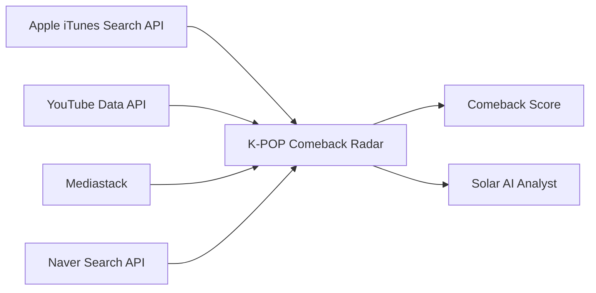

📡 K-POP Comeback Radar
Apple Music Style K-POP Intelligence Dashboard
Apple Music · YouTube · Global News · Naver News · Solar AI
🌐 Live App
---
✨ Overview
K-POP Comeback Radar는 K-POP 아티스트의 최신 발매, YouTube 반응, 국내외 뉴스, AI 분석을 한 화면에서 확인할 수 있는 Streamlit 기반 데이터 대시보드입니다.
이 프로젝트는 다음 질문에 답하는 것을 목표로 합니다.
최근 발매가 얼마나 새로운가?
YouTube 반응은 어느 정도인가?
국내와 해외 언론의 관심은 어떻게 다른가?
현재 데이터에서 가장 강한 컴백 신호는 무엇인가?
---
🖼 Preview
앱 화면을 캡처한 뒤 아래 경로로 저장하면 GitHub README에 바로 표시할 수 있습니다.
```text
assets/kpop-radar-preview.png
```
README에 아래 코드를 추가하세요.
```md

```
---
🚀 Features
🍎 Apple Music Catalog
최신 앨범
앨범 커버 이미지
발매일
트랙 수
Apple Music 링크
일부 트랙 미리듣기
검색된 앨범 및 트랙 수
🎬 YouTube Signal
최근 업로드 영상
조회수
좋아요 수
댓글 수
채널명
업로드 날짜
🌎 Global News
Mediastack 기반 글로벌 영문 기사
기사 제목
출처
발행일
원문 링크
🇰🇷 Korean News
네이버 검색 API 기반 국내 최신 기사
기사 제목
발행일
원문 링크
📈 Comeback Score
발매 최신성
YouTube 반응
글로벌 뉴스
국내 뉴스
Apple 카탈로그
위 항목을 조합한 프로젝트 자체 지표입니다.
🤖 Solar AI Analyst
현재 수집된 데이터를 기반으로 다음과 같은 질문에 답합니다.
이번 컴백에서 가장 강한 신호는 무엇인가?
국내와 해외 반응의 차이는 무엇인가?
마케팅 관점의 핵심 시사점은 무엇인가?
YouTube 반응과 뉴스 화제성을 비교해 달라
---
🎨 UI Design
이번 버전은 Apple Music 스타일의 화이트·라벤더 UI를 적용했습니다.
화이트·라벤더·핑크 그라데이션
Apple 계열 시스템 폰트 우선 적용
Glassmorphism 카드
KPI 카드 등장 애니메이션
앨범 카드 Hover 효과
모바일 최적화
사이드바 일반 텍스트는 흰색
아티스트 선택창 내부 글씨는 검정색
카드·차트·본문 컬러 체계 통일
Color Palette
Role	Color
Primary Purple	`#6F5BD6`
Deep Purple	`#4F3DB1`
Accent Pink	`#DD6AA7`
Main Text	`#242238`
Muted Text	`#6D6980`
Lavender	`#EEE7FF`
Light Background	`#FFF9FC`
Glass Card	`rgba(255,255,255,.72)`
Typography
```css
-apple-system,
BlinkMacSystemFont,
"SF Pro Display",
"SF Pro Text",
"Pretendard",
"Noto Sans KR",
"Segoe UI",
sans-serif
```
---
🧭 Architecture

---
📊 Comeback Score
Comeback Score는 공식 차트가 아니라 학습용 자체 지표입니다.
Signal	Weight
발매 최신성	30%
YouTube 반응	35%
글로벌 뉴스	15%
국내 뉴스	15%
Apple 카탈로그	5%
Total	100%
Score Guide
Score	Meaning
85–100	🔥 초강력 컴백 신호
70–84	🚀 높은 관심도
55–69	✨ 상승 신호 감지
40–54	🌙 관심도 관찰 중
0–39	📡 레이더 탐색 중
---
🍎 Apple-Only Music Data
음악 데이터는 Apple iTunes Search API를 사용합니다.
```text
https://itunes.apple.com/search
```
이 버전에는 Spotify API, Spotify Secret, Spotify 화면 문구가 포함되지 않습니다.
정상 배포된 최종 버전은 앱 하단에 다음 문구가 표시됩니다.
```text
APPLE-ONLY BUILD 2026-07-23
```
Apple 검색 결과는 공식 인기 순위가 아니라 검색 관련도 순서입니다.
---
🛠 Tech Stack
Category	Technology
Web App	Streamlit
Language	Python
Data Processing	Pandas
Visualization	Plotly
HTTP	Requests
Music	Apple iTunes Search API
Video	YouTube Data API v3
Global News	Mediastack
Korean News	Naver Search API
AI	Upstage Solar
Deployment	Streamlit Community Cloud
Version Control	GitHub
---
📁 Project Structure
```text
my-kpop-app/
├── main.py
├── requirements.txt
├── README.md
└── assets/
    └── kpop-radar-preview.png
```
---
🚀 Installation
1. Clone
```bash
git clone https://github.com/YOUR_GITHUB_ID/YOUR_REPOSITORY.git
cd YOUR_REPOSITORY
```
2. Create Virtual Environment
Windows
```bash
python -m venv .venv
.venv\Scripts\activate
```
macOS / Linux
```bash
python -m venv .venv
source .venv/bin/activate
```
3. Install Packages
```bash
pip install -r requirements.txt
```
4. Run App
```bash
streamlit run main.py
```
---
📦 requirements.txt
```txt
streamlit>=1.41.0
requests>=2.32.0
pandas>=2.2.0
plotly>=5.24.0
```
---
🔑 Streamlit Secrets
Apple iTunes Search API는 별도 키가 필요하지 않습니다.
```toml
YOUTUBE_API_KEY = "YOUR_YOUTUBE_API_KEY"

MEDIASTACK_API_KEY = "YOUR_MEDIASTACK_API_KEY"

NAVER_CLIENT_ID = "YOUR_NAVER_CLIENT_ID"
NAVER_CLIENT_SECRET = "YOUR_NAVER_CLIENT_SECRET"

SOLAR_API_KEY = "YOUR_SOLAR_API_KEY"
SOLAR_MODEL = "solar-pro3"
```
로컬에서는 다음 파일에 저장합니다.
```text
.streamlit/secrets.toml
```
API 키는 `main.py`, `README.md`, 공개 GitHub 저장소에 직접 입력하지 마세요.
---
🧪 Demo Mode
일부 API 키가 없거나 API 호출이 실패해도 앱 전체가 중단되지 않도록 데모 데이터가 제공됩니다.
사이드바에서 다음 옵션을 사용할 수 있습니다.
```text
데모 모드 강제 사용
```
연결 상태 예시:
```text
🟢 Apple Music Catalog
🟢 YouTube
🟢 Mediastack
🟢 네이버 뉴스
🟢 Solar AI
```
---
☁️ Streamlit Cloud Deployment
Deploy Settings
```text
Repository: GitHub 저장소
Branch: main
Main file path: main.py
```
Add Secrets
```text
Manage app
→ Settings
→ Secrets
```
Reboot
```text
Manage app
→ Reboot app
```
Confirm Correct Build
앱 하단에서 다음 문구를 확인합니다.
```text
APPLE-ONLY BUILD 2026-07-23
```
---
📱 Responsive Design
모바일에서는 다음 UI가 자동 조정됩니다.
Hero 타이틀 크기
본문 줄 간격
앨범 커버 크기
카드 패딩과 간격
KPI 숫자 크기
뉴스 탭 크기
채팅 카드 크기
Hover 이동 효과 비활성화
---
🧯 Troubleshooting
이전 Spotify 화면이 표시될 때
GitHub의 `main.py`에서 아래 문자열을 검색합니다.
```text
Spotify
SPOTIFY_API_URL
SPOTIFY_CLIENT_ID
SPOTIFY_CLIENT_SECRET
get_spotify_data
```
최종 Apple 전용 파일에서는 모두 0건이어야 합니다.
반드시 존재해야 하는 문자열:
```text
ITUNES_SEARCH_URL
get_apple_music_data
MEDIASTACK_API_URL
APPLE-ONLY BUILD 2026-07-23
```
Apple Image Quality
고해상도 앨범 이미지는 다음 방식으로 변환합니다.
```python
artwork_high_res = artwork.replace(
    "100x100bb",
    "600x600bb",
)
```
YouTube 403
YouTube Data API v3 활성화 여부
API Key 제한
일일 할당량
Mediastack Error
API Key 확인
무료 플랜 호출량 확인
HTTP/HTTPS 플랜 제한 확인
Naver 401 / 403
Client ID와 Client Secret 확인
검색 API 선택 여부 확인
애플리케이션 환경 등록 확인
Solar Error
API Key 확인
사용 가능한 모델명 확인
`SOLAR_MODEL` 값 확인
---
🔒 Security
추천 `.gitignore`:
```gitignore
.streamlit/secrets.toml
.env
.venv/
__pycache__/
*.pyc
.DS_Store
```
---
📌 Roadmap
[x] Apple iTunes Search API
[x] YouTube Data API
[x] Mediastack
[x] Naver Search API
[x] Solar AI Chat
[x] Glassmorphism UI
[x] Mobile Responsive UI
[ ] 자유 아티스트 검색
[ ] 아티스트 비교
[ ] 컴백 일정 캘린더
[ ] YouTube 반응 추이
[ ] 뉴스 키워드 분석
[ ] AI 자동 요약 카드
[ ] 컴백 알림 기능
---
⚠️ Disclaimer
이 프로젝트는 API 활용, 데이터 시각화, Streamlit 배포와 생성형 AI 연동을 연습하기 위한 개인 프로젝트입니다.
Apple, YouTube, Naver, Mediastack, Upstage, 아티스트 및 기획사와 공식적인 제휴 관계가 없습니다.
모든 상표와 콘텐츠의 권리는 각 소유자에게 있습니다.
---
📡 K-POP Comeback Radar
🍎 Apple Catalog · 🎬 YouTube · 📰 Global & Korean News · 🤖 Solar AI
`APPLE-ONLY BUILD`
